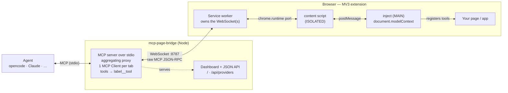

# mcp-page-bridge details

This file keeps the detailed project, authoring, and internals documentation. The root `README.md` is intentionally short and end-user focused.

<p align="center">
  
</p>

<h1 align="center">mcp-page-bridge</h1>

<p align="center">
  Bridge a <strong>live browser page's MCP server</strong> to a coding agent (opencode, Claude, …).
</p>

A page exposes its own tools with [WebMCP](https://github.com/webmachinelearning/webmcp)
(`document.modelContext`, polyfilled by the mcp-page-bridge browser extension where
the browser has no native implementation). The extension tunnels them over a WebSocket to a local bridge, and
the bridge re-exposes everything to the agent as a standard MCP server over
stdio. The agent can then call the page's tools directly.



- **The wire is real MCP JSON-RPC.** Each browser tab is its own MCP *server*;
  the bridge runs one MCP *Client* per tab and merges them into one MCP server
  for the agent (tools namespaced as `label__tool`).
- **Extension-only.** The page never opens a socket itself (an https page can't
  reach `ws://127.0.0.1` due to CSP/mixed-content). The service worker owns the
  WebSocket.
- **Two authoring paths**, same wire:
  - **WebMCP** — `document.modelContext.registerTool({ name, description, inputSchema, execute })`.
  - **Full SDK** — `await window.mcpPageBridge.connect(myMcpServer)` or
    `myMcpServer.connect(window.mcpPageBridge.transport())`.

## Repository layout

```
packages/
  protocol/    shared helpers + the internal channel envelope (dependency-free)
  server/      the mcp-page-bridge bridge: stdio MCP server + WS server + aggregating proxy
  extension/   MV3 extension: inject (WebMCP polyfill + adapter), content relay, SW, popup
examples/
  demo-app/    static page exposing tools via document.modelContext
  svelte-app/  Svelte 5 (runes) app exposing its $state via document.modelContext
```

## Examples

- `examples/demo-app` — zero-build static page. `pnpm --filter @mcp-page-bridge/demo-app serve` → http://localhost:3000
- `examples/svelte-app` — Svelte 5 + Vite app whose runes `$state` is driven by the agent. `pnpm --filter @mcp-page-bridge/example-svelte dev` → http://localhost:5173 (tools: `svelte__increment`, `svelte__add-todo`, `svelte__get-state`, …)

## Quick start

Prereqs: Node ≥ 18, pnpm, a Chromium browser.

```bash
pnpm install
pnpm approve-builds --all      # one-time: allow esbuild's native binary
pnpm -r build                  # builds protocol + dashboard (Go embed) + extension (dist/)
```

1. **Run the bridge** (the agent normally spawns this; you can also run it
   standalone to watch logs):

   ```bash
   pnpm server                                # = go run ./cmd/mcp-page-bridge --daemon
   # or: go run ./cmd/mcp-page-bridge --daemon --port 8787
   # optional auth: go run ./cmd/mcp-page-bridge --daemon --token secret
   ```

   Then open **http://127.0.0.1:8787/** in a browser for the live dashboard —
   it lists connected tabs and their registered tools, with
   shortcuts to focus or close the related browser tab (JSON at `GET /api/providers`).

2. **Load the extension**: open `chrome://extensions`, enable *Developer mode*,
   *Load unpacked* → select `packages/extension/dist`.

3. **Open the demo app**:

   ```bash
   pnpm --filter @mcp-page-bridge/demo-app serve        # http://localhost:3000
   ```

   Open it, click the mcp-page-bridge toolbar icon, and **Enable on this tab**.

4. **Point your agent at the bridge** — see [Connecting your agent](#connecting-your-agent).
   The agent will see `mcp_page_bridge_list_clients` plus the demo's tools
   (`demo__getCount`, `demo__increment`, `demo__setCount`, `demo__getState`).

## Connecting your agent

`mcp-page-bridge` is a **local (stdio)** MCP server: the agent spawns it, and it accepts
the browser's WebSocket and re-exposes the page's tools. Add it to your agent's
MCP config like any other stdio server. (The daemon also exposes a
[Streamable HTTP endpoint](#remote-url--streamable-http) for clients that
prefer a remote URL.)

> **From a local checkout**, replace `npx -y mcp-page-bridge` everywhere below with
> the built binary: `go build -o mcp-page-bridge ./cmd/mcp-page-bridge` and use
> `/ABSOLUTE/PATH/mcp-page-bridge/mcp-page-bridge`. Flags/env are the same.

Flags: `--port <n>` (default 8787), `--token <secret>`, `--host <addr>` (default `127.0.0.1`),
`--profile <secret>` (agent: only see tabs sharing it), `--require-profile`
(daemon: reject connections without a profile key), `--allowed-host <names>`
(extra Host/Origin names for the dashboard/API).
Env: `MCP_PAGE_BRIDGE_PORT`, `MCP_PAGE_BRIDGE_TOKEN`, `MCP_PAGE_BRIDGE_HOST`,
`MCP_PAGE_BRIDGE_PROFILE`, `MCP_PAGE_BRIDGE_REQUIRE_PROFILE`, `MCP_PAGE_BRIDGE_ALLOWED_HOSTS`.

> **Remote browser**: to connect a browser on another device (phone/laptop on
> your LAN), start the bridge with `--host 0.0.0.0 --token <secret>` and set the
> same host/IP + token in the extension popup. A token is **strongly
> recommended** for any non-loopback bind — without one, page tools (`eval`
> etc.) are open to the network and the bridge only logs a warning. The
> Host/Origin checks relax to port matching in this mode; the token carries the
> authorization.
>
> **Reaching it by DNS name / reverse proxy**: the relaxed check still matches on
> port, so a hostname accessed without the matching `:port` (e.g.
> `https://bridge.example.com` behind a proxy) is rejected with
> `request is not local (bad Host/Origin)`. Allow it explicitly with
> `--allowed-host bridge.example.com` (comma-separated for several, env
> `MCP_PAGE_BRIDGE_ALLOWED_HOSTS`). The Origin, when present, must match an
> allowed name too, so cross-origin pages are still blocked.

### Per-tab bridges, profiles, and tab groups

A **bridge** is just a `(host, port, token, secure, profileKey)` tuple. The
extension keeps a small list of these, deduped on that tuple, so two tabs with
the identical config automatically share one bridge (and one tab group). The
popup shows them in a **Bridge** dropdown (most recently used first, capped at 8
with LRU eviction; bridges in use are never evicted). Token-protected bridges
are marked with 🔑 and profile-scoped ones with 👤 (the secrets are never shown).

The bridge is **per-tab and automatic** — there is no "custom bridge" toggle.
Whatever you set in the popup (host/port/token/secure/profile key) becomes the
active tab's bridge; if it differs from another tab's, they are simply different
bridges. The most recently configured bridge is the one **new/unconfigured tabs
inherit**, so the common "one daemon for everything" case needs no per-tab
setup. Changing a tab's bridge bounces only that tab's sockets. The opt-in
**"Browser control"** provider connects on the most-recent (default) bridge.

The optional **"Group tabs by bridge"** switch (off by default) mirrors the
grouping visually: enabled tabs are placed into Chrome tab groups named
`host:port` with a per-profile color. Only groups created by the extension are
ever touched, and turning the switch off releases the tabs again.

Multiple agents can use the same port. On first use, `mcp-page-bridge` starts a
detached local bridge daemon that owns the browser WebSocket/dashboard port.
Every agent process, including the first one, attaches its stdio MCP connection
to that daemon over a local `/agent` WebSocket. Closing the first agent session
only closes that session's proxy; the bridge daemon keeps running for later
agents and browser tabs. If you use `--token`, every agent process must use the
same token.

When browser providers connect or disconnect, the daemon sends MCP
`tools/listChanged`, `prompts/listChanged`, and `resources/listChanged`
notifications to all attached agents so they can invalidate cached catalogs and
list again. Tool identity is the namespaced tool name (`label__tool`), never its
position in a list. Duplicate provider labels are reserved by browser
tab/provider identity inside the daemon, so the same provider keeps its namespace
across reconnects even if other providers reconnect in a different order.

To stop the daemon, either:

- run `mcp-page-bridge stop --port <n>` (add `--token <secret>` if the daemon
  uses one), or
- open the dashboard at `http://127.0.0.1:<port>/` and click **Shutdown bridge**.

Both call `POST /api/shutdown`; the bridge closes its browser and agent sockets,
stops the HTTP/WebSocket listener, removes its PID file, and the detached daemon
process exits once no handles remain. The daemon writes its PID to
`<os-tmp>/mcp-page-bridge-<port>.pid` so `stop` can fall back to a signal if the
HTTP request fails.

Pass `--idle-timeout <seconds>` to have a freshly spawned daemon shut itself down
after that many seconds with no attached agents and no connected browser
providers (off by default). The agent that first spawns the daemon forwards this
flag.

### Local HTTP security

The bridge binds to `127.0.0.1` and validates the `Host`/`Origin` of every HTTP
request, so other web pages (and DNS-rebinding attempts) cannot reach the JSON
API or the shutdown/tab-control endpoints. State-changing requests additionally
require an internal dashboard header. When a `--token` is configured it is
required on the HTTP API too — open the dashboard as
`http://127.0.0.1:<port>/?token=<secret>` so its requests carry the token.

### Runtime: Node, Bun, or Deno

Node isn't required — it's just the default. The bridge's only runtime
dependencies are `ws` and `node:crypto` (both supported by Bun and Deno), and
the MCP SDK is cross-runtime, so the agent's `command` can use any of:

| Runtime | `command` example |
| --- | --- |
| Node | `["npx", "-y", "mcp-page-bridge", "--port", "8787"]` |
| Bun | `["bunx", "mcp-page-bridge", "--port", "8787"]` |
| Deno | `["deno", "run", "-A", "npm:mcp-page-bridge", "--port", "8787"]` |

The npm package is a thin launcher around the native Go binary, so the runtime
above only spawns the launcher — the bridge itself has no Node/Bun/Deno
dependency. You can also skip npm entirely and run the
[standalone binary](https://github.com/rytsh/mcp-page-bridge/releases) directly.

### opencode

`opencode.json` (project) or `~/.config/opencode/opencode.json` (global):

```jsonc
{
  "$schema": "https://opencode.ai/config.json",
  "mcp": {
    "mcp-page-bridge": {
      "type": "local",
      "command": ["npx", "-y", "mcp-page-bridge", "--port", "8787"],
      "enabled": true
      // optional token: add "--token", "secret" above, or:
      // "environment": { "MCP_PAGE_BRIDGE_TOKEN": "secret" }
    }
  }
}
```

opencode prefixes MCP tools with the server name, so the demo's tools show up as
`mcp-page-bridge_demo__increment`, etc. Prompt with e.g. *"use the mcp-page-bridge tools to …"*.

### Claude Code (CLI)

```bash
claude mcp add mcp-page-bridge -- npx -y mcp-page-bridge --port 8787
# with a token:
claude mcp add mcp-page-bridge --env MCP_PAGE_BRIDGE_TOKEN=secret -- npx -y mcp-page-bridge --port 8787
```

### Claude Desktop

Edit `claude_desktop_config.json` (macOS: `~/Library/Application Support/Claude/`,
Windows: `%APPDATA%\Claude\`), then restart the app:

```json
{
  "mcpServers": {
    "mcp-page-bridge": { "command": "npx", "args": ["-y", "mcp-page-bridge", "--port", "8787"] }
  }
}
```

### Cursor / Windsurf / VS Code (and other `mcpServers` clients)

`.cursor/mcp.json` (project) or the client's global MCP config:

```json
{
  "mcpServers": {
    "mcp-page-bridge": {
      "command": "npx",
      "args": ["-y", "mcp-page-bridge", "--port", "8787"],
      "env": { "MCP_PAGE_BRIDGE_TOKEN": "" }
    }
  }
}
```

### Any other MCP client

It's a standard stdio MCP server — run `npx -y mcp-page-bridge` (or a standalone
binary) as the command. `stdout` is the MCP channel; logs go to `stderr`.

### Remote URL — Streamable HTTP

The daemon also serves the MCP **Streamable HTTP** transport at
`http://<host>:<port>/mcp`, so clients that support remote MCP servers can skip
the stdio proxy entirely and connect by URL — including to a daemon on another
machine (start it there with `--host 0.0.0.0 --token <secret>`):

```jsonc
// opencode
{
  "mcp": {
    "mcp-page-bridge": {
      "type": "remote",
      "url": "http://192.168.1.50:8787/mcp",
      "headers": { "Authorization": "Bearer <secret>" },
      "enabled": true
    }
  }
}
```

```bash
# Claude Code
claude mcp add --transport http mcp-page-bridge http://192.168.1.50:8787/mcp \
  --header "Authorization: Bearer <secret>"
```

Endpoint behaviour:

- `POST /mcp` — JSON-RPC requests. `initialize` opens a session and returns an
  `Mcp-Session-Id` response header; all later requests must echo that header.
  Notifications are answered with `202 Accepted`. An unknown/expired session
  returns `404` (re-initialize). JSON-RPC batching is not supported.
- `GET /mcp` — optional SSE stream (one per session) carrying server-initiated
  notifications: `tools/prompts/resources list_changed` and forwarded page
  `notifications/message` logs.
- `DELETE /mcp` — ends the session. Sessions also expire after 30 minutes
  without requests (an open SSE stream keeps them alive), and they count as
  agent connections for `--idle-timeout` purposes.
- When a token is configured, every `/mcp` request must carry it as
  `Authorization: Bearer <secret>`, an `x-mcp-page-bridge-token` header, or a
  `?token=<secret>` query parameter.

### Putting it together

1. Start a session — your agent spawns `mcp-page-bridge` (or run it yourself to watch logs).
2. Open your page, click the **mcp-page-bridge** toolbar icon → **Enable on this tab** (set
   the same port/token as the bridge).
3. The agent now sees `mcp_page_bridge_list_clients` plus your page's tools. A good first
   prompt: *"call mcp_page_bridge_list_clients to see which browser tabs are connected."*

## Authoring tools in your own page

### WebMCP (`document.modelContext`)

Use the standard [WebMCP](https://github.com/webmachinelearning/webmcp) API. Tool
names must be 1-128 characters of `[A-Za-z0-9_.-]`, and `description` is
required.

```js
await document.modelContext.registerTool({
  name: "add-item",
  title: "Add item",                       // optional, for human-facing UI
  description: "Add an item to the cart",
  inputSchema: { type: "object", properties: { id: { type: "string" } }, required: ["id"] },
  annotations: { readOnlyHint: false },    // forwarded to the agent in tools/list
  async execute({ id }, { signal }) {
    return store.addItem(id, { signal });
  },
});
```

`execute` may return anything JSON-serializable (coerced to a text content
block), or a full MCP tool result — `{ content: [{ type: "text", text }], isError?,
structuredContent? }`.

Unregister with an `AbortSignal`; the agent's tool list updates live via
`notifications/tools/list_changed`:

```js
const controller = new AbortController();
await document.modelContext.registerTool(tool, { signal: controller.signal });
controller.abort();
```

**Availability.** `document.modelContext` is native in the Chrome 149 / Edge 150
origin trials. Everywhere else the extension installs a spec-shaped polyfill at
`document_start` (`packages/extension/src/webmcp.ts`) — before any page script
runs, so there is no timing dependency and no need to listen for a ready event.
When a native implementation *is* present the extension leaves it alone and reads
through `getTools()` / `executeTool()` / `toolchange` instead. Feature-detect with
`if (document.modelContext)` so the page degrades cleanly when neither exists.

Install TypeScript types with `npm i -D webmcp-types`.

Polyfill limitations vs. the native API: `exposedTo` / `fromOrigins` are honored
only for same-origin frames (there is no cross-origin `postMessage` plumbing), and
the Permissions Policy `tools` feature is not consulted. The extension injects
into the top frame only, so tools registered inside iframes are not picked up by
the polyfill.

### WebMCP is not MCP — where the bridge adapts

WebMCP and MCP share a vocabulary, not a schema. MCP is the contract that is
actually enforced: the agent's client validates every `tools/list`,
`prompts/list` and `resources/list` response, and the bridge merges **all**
providers in a partition into one response — so one malformed page would
otherwise invalidate every other tab's catalog. Providers are untrusted page
code, so the bridge repairs what it can and drops what it cannot.

**1. Schema shape.** MCP requires `{"type": "object", …}` at the root of
`inputSchema`/`outputSchema`, `properties` to be an object of objects, and
`required` to be a `string[]`. WebMCP constrains none of this.

| Page sends | Agent sees |
| --- | --- |
| `{type:"object", …}` | unchanged |
| `{properties:{…}}` (no `type`) | `type:"object"` added, fields kept |
| `{type:"string"}` | `type` corrected, fields kept |
| `required: "name"` | promoted to `["name"]` |
| `required: [1,2]` / `properties: []` | field dropped, rest kept |
| non-object property values | those entries dropped, valid ones kept |
| array / string / `null` / malformed | `{"type":"object","additionalProperties":true}` |
| absent | `{"type":"object","additionalProperties":true}` |

An unsalvageable `outputSchema` is dropped rather than advertised (it is
optional). The extension warns in the page console
(`packages/extension/src/webmcp.ts`); the bridge repairs again at ingest for
providers that do not go through it — full MCP SDK servers included — and logs
`repaired invalid MCP tool`.

**Prompts and resources get the same treatment** (`internal/bridge/normalize.go`):
a prompt's `arguments` must be an array of objects each carrying a string
`name`; a resource's `size` must be a number. Entries that cannot be routed at
all — a prompt without a `name`, a resource without a `uri` — are dropped and
logged rather than shipped. A provider that returns a non-object catalog entry
loses only that entry, not its whole catalog, and `nextCursor` pagination is
followed instead of truncating at page one.

**2. `untrustedContentHint` has no MCP slot.** WebMCP's `ToolAnnotations` is
`{readOnlyHint, untrustedContentHint}`; MCP's is `{title, readOnlyHint,
destructiveHint, idempotentHint, openWorldHint}`. A validating MCP client
*silently strips* `untrustedContentHint` — the one hint that signals
prompt-injection risk. So a tool marked untrusted also gets:

- `_meta: { "webmcp/untrustedContentHint": true }` — MCP's reserved extension bag
  is `Record<string, unknown>`, so it survives passthrough intact.
- an `[untrusted output] ` prefix on the description, which is what the model
  actually reads.

The original `annotations` still ride along for clients that understand them.

**3. Tool name length.** WebMCP allows 128-character names; the bridge prepends
`label__` (up to 42 more). MCP sets no limit, but many agent hosts reject names
over 64 characters. `protocol.NamespaceName` clamps to 64 with a deterministic
`-<6 hex>` FNV-1a suffix, so the name is stable across reconnects and two long
names sharing a prefix cannot collapse onto one. The routing table is built with
the same function, so a clamped tool stays callable. The Go and TypeScript copies
are pinned to identical golden vectors by `TestNamespaceNameGoldenVectors` and
`protocol-namespace.test.ts`.

**4. `exposedTo` is additive, not restrictive.** Per the spec's
["tool is exposed to an origin"](https://webmachinelearning.github.io/webmcp/#tool-is-exposed-to-an-origin)
algorithm, a same-origin caller is *always* allowed and `exposedTo` grants extra
origins on top. The extension runs in the page's own world, so it is same-origin
and sees every tool — `exposedTo` is not a way to hide a tool from the bridge.
Use `window.mcpPageBridge.builtins(false)` or simply do not register the tool.

### Bridge-specific knobs (`window.mcpPageBridge`)

WebMCP has no concept of a provider label, of the extension's built-in toolset,
or of the bridge transport. Those live on `window.mcpPageBridge`, which only
exists when the extension is installed — always use optional chaining:

```js
window.mcpPageBridge?.setLabel("checkout"); // tools become checkout__add-item
window.mcpPageBridge?.builtins(false);      // drop all built-in tools
window.mcpPageBridge?.allowEval(false);     // drop just `eval`
window.mcpPageBridge?.refresh();            // force a re-read of document.modelContext
window.mcpPageBridge?.connected;            // true once the tab is enabled
window.mcpPageBridge?.nativeWebMcp;         // true when not using our polyfill
```

Without `setLabel`, the label defaults to the page host. Changing it reconnects
the provider so the dashboard and agent see the new namespace.

### Full MCP SDK (resources / prompts / …)

```js
import { McpServer } from "@modelcontextprotocol/sdk/server/mcp.js";
const server = new McpServer({ name: "checkout", version: "1.0.0" });
server.registerTool("getCart", { /* ... */ }, async () => ({ /* ... */ }));
await window.mcpPageBridge.connect(server);
// or: await server.connect(window.mcpPageBridge.transport());
```

## Built-in tools

When a tab is enabled, the extension exposes a lean **core** built-in toolset on
the same provider (so any page is reachable even without registering WebMCP tools):

`eval` (run JS in the page), `dom_query`, `get_html`, `get_page_text`,
`get_page_info`, `take_snapshot`, `find`, `click`, `drag`, `type_text`,
`press_key`, `clear_value`, `set_value`, `scroll`, `wait_for`, `console_logs`
(captured from `document_start`), `screenshot`, `zoom`, `navigate`, `reload`,
`list_downloads`, `wait_for_download`.

**Snapshot → act → observe.** `take_snapshot` returns a compact text tree of the
page's interactive and structural elements, each with a stable `uid`:

```
Page snapshot — "Cart" — https://shop.test/cart
uid=e3 navigation
  uid=e4 link "Home" href="/"
uid=e9 searchbox "Search products" value="socks"
uid=e12 button "Checkout"
iframe f1 — https://payments.test/widget
  uid=f1e2 textbox "Card number"
  uid=f1e5 button "Pay"
```

`take_snapshot` can also be scoped instead of paged through: `rootUid` /
`rootSelector` snapshot a single container's subtree and `maxDepth` (default 15)
caps the tree depth, which is how you read one panel of a large app without
paying for the whole page.

Cross-origin iframes are included: the service worker injects a small per-frame
agent into every frame, collects each frame's lines and stitches them into one
tree, prefixing sub-frame uids with the frame index (`f1e2`). Acting on such a
uid is routed back to that frame automatically, so embedded checkout widgets,
editors and ad frames are reachable — the top document keeps bare uids (`e12`).
Pass `allFrames:false` to snapshot only the top document. Uids go stale on
navigation and DOM changes; re-snapshot then.

**Finding things cheaply.** `take_snapshot` is the complete view; `find` is the
cheap one. Describe the control in plain words — `"add to cart button"`,
`"email field"`, `"pricing link"` — and it returns a handful of ranked, uid-tagged
matches you can act on immediately. Role words in the query (`button`, `field`,
`link`, `dropdown`, …) filter by role, the rest is matched against accessible
names, placeholders, titles and test ids. All scoring is local; there is no extra
model call.

**Reading a page.** `get_page_text` returns the page's *rendered* text the way a
reader sees it — visible text only, block structure kept as line breaks,
headings marked with `#` — defaulting to the main content region. Use it instead
of `get_html` for articles and documentation: raw HTML costs several times the
tokens for the same information.

**Actions observe by default.** `click`, `drag`, `type_text`, `press_key` and `scroll`
append a fresh, shortened uid snapshot to their result, so "click and see what
happened" is one call instead of three. Control it per call with `observe`:
`"snapshot"` (default), `"screenshot"`, `"both"`, or `"none"`. Screenshots stay
opt-in because they are expensive for agents that never look at pixels;
`set_value` and `clear_value` default to `"none"`.

An observation also carries a short **tab context** note when the ground moved
under the agent: this tab navigated, or the action opened a new tab (with its id
and whether the bridge is enabled on it). Without it an agent that clicks a
`target="_blank"` link keeps driving the old tab and cannot tell why nothing
changed. Only this tab's own navigations and the tabs it opened are reported —
never the user's whole tab list — and each is reported once.

**Screenshots.** `screenshot` captures the visible tab by default;
`fullPage:true` captures the whole scrollable page through CDP (needs the
optional debugger permission — enable Trusted input or the CDP toolset — and
falls back to the viewport with a note otherwise). `refs:true` labels every
element from the last snapshot with its uid, in every frame, captures, and
removes the labels again, so the image and the uid tree line up.
`download:true` also saves the PNG to the browser's Downloads folder, and
`maxWidth` downscales the capture so a retina screenshot stays under the model's
image size limits.

Every screenshot result states its pixel size, the CSS-pixel viewport it maps to,
and the divisor between them. That matters because `click{x,y}` and `scroll{x,y}`
take **CSS pixels** while the image is `devicePixelRatio` times larger; without
the note an agent reading a position off the image would click the wrong place.
`get_page_info` reports the same frame (viewport, scroll offset, `devicePixelRatio`).

`zoom` crops a region of the viewport and returns it enlarged — for reading small
text or checking a control's state without spending a full screenshot. Give it
`x`/`y`/`width`/`height` or a `selector`. Coordinates you read off a zoomed image
are still full-viewport coordinates; the crop does not move the origin.

**Input primitives.** `click`, `type_text`, `press_key`, and `clear_value` share
one locator + input engine, so every target can be given as a `uid` (from
`take_snapshot`/`find`), a CSS `selector`, visible `text`, a `role`+`name` pair, a
form `label`, or a `testId` — and `click` also accepts raw viewport `x`/`y`
coordinates. `click` waits until the element is visible, enabled, stable and not
covered before acting (`force:true` skips the checks).

`click` carries a real `button` and `modifiers`, not just a target: `button:"right"`
fires `contextmenu` (the event a custom context menu listens for), `"middle"`
fires `auxclick`, `clickCount` 2/3 double- and triple-clicks, and
`modifiers:"ctrl"` / `"shift"` hold keys during the click for multi- and
range-selection. A coordinate click descends into same-origin iframes, so an
`x`/`y` that lands inside an embedded document hits the real element rather than
the `<iframe>` box.

`drag` presses at the source, moves in steps, and releases at the target. The
stepped pointer sequence is what modern drag-and-drop listens for — dnd-kit,
sortable lists, sliders, canvas editors, resize handles — none of which react to
HTML5 `DragEvent`s alone; those are fired too when the source element is
`draggable`, so legacy drop targets keep working from the same tool. Either end
can be a `uid`/`selector` or raw coordinates, and `steps`/`holdMs`/`settleMs`
tune how patient the gesture is.

`type_text` types character by character, dispatching the same
`keydown`/`beforeinput`/`input`/`keyup` sequence a real keystroke produces, so
autocomplete, search-as-you-type and controlled React/Vue inputs react the way
they do for a user. It clears the field first unless `clear:false`/`append:true`,
and `submit:true` presses Enter at the end. Key presses can be embedded in the
text with `<kbd>…</kbd>` markup:

```jsonc
{ "text": "jane <kbd>Tab</kbd>doe", "selector": "#firstName" }
{ "text": "mcp page bridge", "role": "searchbox", "submit": true }
```

`press_key` takes a space-separated chord sequence — `Enter`, `Escape`,
`Shift+Tab`, `Meta+A Backspace`, `ArrowDown ArrowDown Enter` — plus optional
`repeat`/`delayMs`/`holdMs`. `holdMs` keeps each key down (auto-repeating, like a
real held key) before releasing it, for press-and-hold handlers. `Meta` and `Mod` are platform-aware (Cmd on macOS, Ctrl
elsewhere) so a select-all works everywhere; `Cmd` and `Ctrl` are literal.
Because synthetic keys don't drive the browser's default actions, the engine
emulates the important ones: Enter submits the form from a single-line input (or
clicks a non-editable target), Backspace/Delete edit the value at the caret, and
`Meta/Ctrl+A` selects the field contents.

**Scrolling.** `scroll` has three modes. `selector` scrolls an element into view,
`x`+`y` scrolls the window to an offset, and `direction`+`amount` dispatches a
real mouse **wheel** at a point. Only the wheel mode reaches inner scroll
containers, virtualized lists, maps and carousels — they never see
`window.scrollTo`. Because a synthetic wheel event does not scroll by itself, the
engine applies the scroll to the nearest scrollable ancestor afterwards, unless
the page called `preventDefault()` (which is exactly what wheel-driven UIs do).

**Waiting.** `wait_for` waits for a selector to appear, for it to disappear
(`gone:true` — spinners, overlays), or simply for a fixed `durationMs` when the
page offers no observable marker.

**Downloads.** A page action that produces a file used to be a dead end: something
landed in the Downloads folder and the agent had no way to learn the path.
`wait_for_download` waits for the next download to finish and returns its
filename, size and on-disk **path**; `list_downloads` reports recent ones. The
path is on the machine running the browser, so the agent's own filesystem tools
can read the file it just exported.

**Trusted input (opt-in).** By default these tools build the events in the page,
so `event.isTrusted` is `false` — which some pages (canvas apps, bot-protected
forms, a few component libraries) ignore. Turn on **Trusted input (real
key/mouse events)** in the popup and `click`/`type_text`/`press_key` dispatch
through CDP `Input.dispatchMouseEvent`/`Input.dispatchKeyEvent` in the service
worker instead. It requests the same optional `debugger` permission the CDP
toolset uses, but without adding any tools to the catalog.

Because CDP delivers input to the *focused* tab, each trusted action briefly
activates the target tab (and its window) and restores the previous focus
afterwards. When the CDP toolset isn't otherwise attached, the debugger is
attached only for the duration of the action, so Chrome's debugging banner shows
just while the agent is clicking/typing. Every trusted attempt falls back to the
synthetic path if anything fails, and the tool result records which path ran:

```jsonc
{ "clicked": { "selector": "#buy", "role": "button" }, "clickCount": 1, "via": "cdp" }
{ "target": "(focused element)", "pressed": 2, "via": "js", "trustedError": "…" }
```

These four tools are registered whenever *either* the core or the automation
toolset is on, so a page that turns core tools off still has working input.
`set_value` remains as the one-shot value setter (useful for `<select>` and for
pages that block typing); prefer `type_text` whenever the page reacts to
keystrokes.

The popup's **Core tools (default MCPs)** switch controls this lean default
toolset and is checked by default. Turn it off before enabling a tab if you only
want page-declared tools and/or the opt-in tool groups below.

This core set is kept small on purpose: every tool's name + schema sits in the
agent's tool list and costs tokens for the whole session, so the heavier
**design/selection toolset** below is **opt-in**. Turn it on with the **Design
tools** switch in the popup (off by default); the change applies to enabled tabs
immediately. With design tools off the catalog is ~12 tools; on, it adds the 21
selection/CSS/audit tools listed below.

The popup also has a separate **Automation tools** switch for Playwright-like live
page automation. It adds locator helpers (`locator_snapshot`, `locator_count`),
extra actions (`hover`, `select_option`, `check`, `uncheck`, `upload_file`,
`mouse` — all accepting `uid` or a locator, and building
on the same core `click`/`drag`/`type_text`/`press_key` engine), page-level `fetch`/`XMLHttpRequest` capture
(`start_network_capture`, `stop_network_capture`, `list_network_requests`,
`wait_for_response`, `get_response_body`, `clear_network_capture`),
storage/cookie helpers, dialog auto-handling,
same-origin iframe helpers, and best-effort `resize_window`. This is not a full
Playwright replacement: there is no isolated browser context, HTTP-only cookie
access, trace viewer, or video.

`mouse` is the low-level escape hatch for gestures `drag` cannot express —
multi-stop paths, press-move-hold-release, canvas painting. Sequence it:
`down` → `move` → `move` → `up`, all in CSS-pixel viewport coordinates.

`upload_file` attaches a file to an `input[type=file]`. Small content can be
passed inline (`base64`/`text`), but anything real should use `path`: the bridge
daemon reads the file from disk and hands the bytes to the extension, so it never
travels through the model's context. That form requires the daemon to be started
with `--upload-dir <dir>` and the file to live inside it — see
[File uploads by path](#file-uploads-by-path).

Four earlier tools were removed once the core engine covered them:
`find_by_text`/`find_by_role`/`find_by_label`/`find_by_test_id` (use `find`, or
`locator_snapshot` with the same locator fields), `double_click` (use `click`
with `clickCount:2`), and `drag_and_drop` (use `drag`, which does a real pointer
drag instead of HTML5 events only). Every tool's schema costs tokens for the
whole session, so duplicates are not free.

Every built-in tool's text output is clamped (~40k characters) with an explicit
truncation note, so one oversized `eval` result or CDP payload can't swallow the
agent's context.

For browser-protocol-level work, the popup has a separate **Advanced CDP tools**
switch. It requests Chrome's optional `debugger` permission only when enabled.
Chrome shows a debugging banner while CDP is attached; turning the switch off or
calling `cdp_detach` detaches it. CDP tools include `cdp_status`, `cdp_attach`,
`cdp_detach`, `cdp_send_command`, `cdp_list_events`, `cdp_clear_events`,
`cdp_get_response_body`, `cdp_emulate_viewport`, `cdp_clear_emulation`,
`cdp_dispatch_mouse`, `cdp_dispatch_key`, `cdp_evaluate`,
`cdp_capture_screenshot`, `cdp_get_performance_metrics`,
`cdp_set_network_conditions`, `cdp_set_user_agent`, and `cdp_set_geolocation`. They can see browser-level
network events and use CDP input/emulation APIs, but still do not create
Playwright-style isolated browser contexts or multi-browser sessions.

Design tools: click **Pick element** in the popup, select a page
element, then tell your agent something like "make the place I picked look
better". **Pick element** replaces the current selection, **Add another** keeps
existing yellow markers and adds one more, **Clear selection** forgets them, and
the **View selection** switch hides/shows the markers without forgetting them.
The popup lists picked elements; each row can be named/grouped inline and has an
**×** button to unselect only that element. The popup also lists live CSS patches
with **Undo** and **Clear all** actions.
With the **Design tools** switch on, the agent can call `get_selected_element`,
`get_selected_elements`,
`get_computed_style`, `highlight_element`, `show_selected_marker`,
`hide_selected_marker`, `clear_selected_elements`, `remove_selected_element`,
`update_selected_element`, `apply_css`, `list_css_patches`, `remove_css_patch`,
`clear_css_patches`, `export_css_patches`, `export_design_changes`,
`capture_design_baseline`, `compare_design_baseline`, `clear_design_baseline`,
`accessibility_audit`, `responsive_summary`, and `debug_summary`. CSS patches
are temporary style tags in the live page and can be rolled back by patch id.
When the user asks to change a picked/selected/yellow element, agents should call
`get_selected_element` first, then call `apply_css` with `selector` omitted and
CSS declarations only (for example `color:red;`). Complete CSS rules such as
`.hero { color:red; }` are global/page-wide and are rejected while a selector or
picked element is targeted.

The picker closes the extension popup, shows an overlay on the page, records the
next clicked element in the page's built-in tool state, and leaves persistent
yellow transparent markers on picked elements. You can refer to them as "the
yellow selected areas" in the agent chat. It works on normal `http`/`https` pages;
Chromium blocks extension scripts on pages such as `chrome://`, the Chrome Web
Store, and some restricted browser pages.

Disable all built-ins per page with `window.mcpPageBridge.builtins(false)` before the tab
is enabled, or disable only the powerful `eval` tool (keeping the rest) with
`window.mcpPageBridge.allowEval(false)`. Note: `eval` is also blocked on pages with a
strict `Content-Security-Policy` (no `unsafe-eval`), such as GitHub. On those
pages, use the dedicated non-eval tools (`dom_query`, `get_selected_element`,
`apply_css`, `click`, etc.) instead of injecting inline/script-tag JavaScript.

### Browser control (opt-in)

By default tools are **tab-scoped** — they act on the page they're registered
in. Enable **"Browser control (all tabs)"** in the popup to also expose a
separate **`browser`** provider (hosted by the service worker, independent of any
page) with: `list_tabs`, `open_tab`, `activate_tab`, `navigate_tab`,
`enable_tab`, `close_tab`, `close_agent_tabs`. This is more powerful (it can
open/close/navigate *any* tab), so it's off by default. It's still localhost-only
and every call is gated by your agent's permission prompts.

**Agent-owned tabs.** `open_tab` enables the bridge on the tab it creates
(`enable:false` opts out), so the agent can immediately use that page's tools
instead of waiting for a human to click *Enable on this tab* in the popup. Such
tabs are tracked for the session: `close_agent_tabs` closes exactly those and
leaves the user's own tabs alone, and `list_tabs` reports `enabled` and
`openedByAgent` per tab. `enable_tab` does the same for a tab the user already
had open. Restricted pages (`chrome://`, the Web Store) are reported as
`enabled: false` rather than silently failing later.

## How it connects / is detected

- The extension installs/adopts `document.modelContext` at `document_start` (MAIN world).
- A page opts in by calling `document.modelContext.registerTool(...)`, or by
  connecting a full MCP server with `window.mcpPageBridge.connect(...)`.
- Nothing connects until the tab is **enabled** in the popup. On enable, the SW
  opens one WebSocket per provider to the bridge; the bridge runs the MCP
  `initialize` handshake and reads the provider's `serverInfo`/tools.
- Multiple tabs can connect simultaneously; their tools are namespaced by label.
  `mcp_page_bridge_list_clients` shows what's connected.

## Profiles (multi-user isolation)

A **profile key** partitions one daemon into isolated views. Each browser tab
and each agent connects with an optional secret; the bridge groups them by it,
so an agent only ever sees the tabs that share its profile key. This is the
multi-user feature: many people can share a single (e.g. remote) daemon while
each only sees their own pages.

**How it works on the wire.** Clients send the **raw secret** (like the token):
the extension and stdio proxy as `?profile=<secret>`, the Streamable HTTP
transport as the `x-mcp-page-bridge-profile` header or `?profile=<secret>`. The
daemon hashes it (SHA-256 over a fixed domain-separation prefix; see
`protocol.HashProfile`) into the opaque partition key and matches on the full
digest — so there is no timing oracle and no way to enumerate other partitions,
and the **same secret value works on every transport**.

**What is partitioned.** Everything an agent can observe is scoped to its
profile: `tools/list`, `prompts/list`, `resources/list`, `tools/call` /
`prompts/get` / `resources/read` routing, the `mcp_page_bridge_list_clients`
summary, the `*/list_changed` and logging notifications, the dashboard JSON
(`/api/providers?profile=<secret>`), and tab activate/close actions. A call that
names another partition's namespaced tool is rejected as "unknown", exactly as
if it did not exist.

**Default partition (backward compatible).** A tab/agent with *no* profile key
joins the default, unpartitioned partition — the original behaviour. Profiled and
profile-less peers never see each other, so opting in for some tabs does not
change anything for the rest.

**Setting it.**

- Extension: the popup's **Profile key** field. It is part of the bridge profile
  tuple `(host, port, token, secure, profileKey)`, so a different key is treated
  as a different daemon "group" (its tabs reconnect when you change it).
- stdio proxy / agent: `--profile <secret>` (or `MCP_PAGE_BRIDGE_PROFILE`).
- Remote `/mcp` clients (no proxy): pass the same secret in the
  `x-mcp-page-bridge-profile` header or `?profile=<secret>` on the URL.
- Dashboard: open `…/?token=<secret>&profile=<secret>`, or just open `/` and use
  the **Profile…** button to enter the key. When the daemon runs with
  `--require-profile` (or needs a token), the dashboard **locks** and shows a
  login card asking for the token/profile before any tabs are listed — so a
  shared dashboard only ever reveals the partition whose password you enter. The
  active partition is shown by the **partition: profiled / default** chip.

**Operator strictness.** `--require-profile` (env
`MCP_PAGE_BRIDGE_REQUIRE_PROFILE`; surfaced as `requiresProfile` on
`/api/health`) makes the daemon reject any provider/agent that connects without a
profile key — a true multi-user daemon with no anonymous default partition. It is
off by default. A daemon spawned implicitly by a stdio agent inherits this flag
from that agent.

**Security notes.** The profile secret is a *bearer credential* on the wire (it
travels raw, like the token, and the daemon sees it before hashing). So for any
non-loopback/shared daemon keep using `--token` (network gate) **and** TLS
(transport secrecy), and choose a strong, high-entropy profile secret. The
profile key is independent of `--token`: the token controls who may reach the
daemon at all; the profile controls which tabs they can see once connected.

## File uploads by path

`upload_file { path }` lets an agent attach a real file from disk to a page's
`<input type=file>` — an invoice, a fixture, a screenshot it just took. A browser
extension has no filesystem access, so the **daemon** reads the bytes and hands
them to the extension over the tab's own socket
(`mcpPageBridge/readFile`). The alternative, base64 through the model's context,
stops being practical past a few kilobytes.

That is a genuine privilege escalation — any page on a bridged tab can reach the
method — so it is **off unless you opt in**, and the daemon is the single place
that enforces the boundary:

```bash
mcp-page-bridge --daemon --upload-dir ~/agent-uploads
```

- Without `--upload-dir` (the default) every path upload is refused.
- The requested path is resolved **through symlinks first**, then required to
  stay inside the directory, so a link placed in the directory cannot reach out
  of it. Relative paths are taken relative to it.
- Regular files only, capped at 32 MiB.

Point it at a dedicated directory. In particular **do not point it at the
browser's download folder** — otherwise every file a page can make the browser
download becomes a file it can make the browser upload somewhere else.

Env equivalent: `MCP_PAGE_BRIDGE_UPLOAD_DIR`.

## Security

- The bridge binds to `127.0.0.1` by default. Binding a non-loopback host
  (`--host 0.0.0.0`) without a token is allowed but logs a warning — anyone on
  the network can then reach the connected pages' tools (WebSocket and
  `/mcp`); only do this on a trusted/isolated network.
- Optional shared token: run `mcp-page-bridge --token <secret>` (or `MCP_PAGE_BRIDGE_TOKEN=<secret>`)
  and enter the same token in the extension popup. Without it, any local process
  can connect — fine on a trusted machine.
- Built-in TLS: `--tls-cert <fullchain.pem> --tls-key <privkey.pem>` makes the
  daemon serve `https://`/`wss://`, protecting the token and all traffic on
  the wire. Clients opt in with `--tls` (the stdio proxy and `stop` then dial
  `https`/`wss`), plus `--tls-ca <ca.pem>` to trust a private CA or
  `--tls-insecure` to skip verification (testing only). The extension has a
  matching **Secure connection (TLS / wss)** toggle per bridge profile; the
  browser must trust the certificate. Binding a non-loopback host without TLS
  logs a warning. Env equivalents: `MCP_PAGE_BRIDGE_TLS`,
  `MCP_PAGE_BRIDGE_TLS_CERT`, `MCP_PAGE_BRIDGE_TLS_KEY`,
  `MCP_PAGE_BRIDGE_TLS_CA`, `MCP_PAGE_BRIDGE_TLS_INSECURE_SKIP_VERIFY`.
- Tool calls execute code in your page; the agent gates each call behind its own
  permission prompts.
- `upload_file { path }` is refused unless the daemon runs with `--upload-dir`,
  and then only inside that directory — see
  [File uploads by path](#file-uploads-by-path).
- For sharing one daemon between several users, add a **profile key** so each
  agent only sees its own tabs — see
  [Profiles (multi-user isolation)](#profiles-multi-user-isolation).

## Development

```bash
go test ./...     # bridge test suite (e2e over real sockets); requires Go
pnpm test         # vitest (extension + embedded server e2e against the Go bridge)
pnpm typecheck    # tsc across all packages
pnpm --filter @mcp-page-bridge/extension dev   # rebuild extension on change
pnpm server                                    # run the bridge daemon in the foreground
pnpm --filter mcp-page-bridge-dashboard dev    # dashboard UI with Vite dev server
```

> The extension e2e tests spawn the Go bridge, so a Go toolchain is required
> for `pnpm test` as well.

### Local Extension Build

If you do not want to use a release zip, build the extension locally:

```bash
pnpm install
pnpm approve-builds --all
pnpm --filter @mcp-page-bridge/extension build
```

Then open `chrome://extensions`, enable **Developer mode**, click **Load unpacked**, and select `packages/extension/dist`.

### The Go bridge and npm distribution

The bridge implementation is Go (`cmd/mcp-page-bridge` + `internal/`, built on
the rakunlabs stack: into/logi/chu/ada). Release binaries (~9 MB, CGO-free) are
built with goreleaser and attached to each GitHub Release.

The `mcp-page-bridge` npm package is a thin launcher (esbuild/turbo model): the
binary ships in per-platform packages (`mcp-page-bridge-linux-x64`, …) wired as
`optionalDependencies`, so `npx -y mcp-page-bridge` downloads only the binary
matching your machine and passes stdio straight through.

```bash
go test ./...                  # Go test suite (bridge e2e over real sockets)
go build ./cmd/mcp-page-bridge
pnpm build:binaries            # goreleaser snapshot build for all 5 targets → dist/
pnpm build:npm-packages        # dist/ → npm-dist/ per-platform npm packages
```

The status dashboard is a Svelte app in `packages/dashboard`, built to a single
HTML file and embedded into the binary via `go:embed`. After changing it, run
`pnpm --filter mcp-page-bridge-dashboard build` and commit the regenerated
`internal/server/assets/dashboard.html`.

## Status

- [x] Bridge (Go): stdio MCP proxy, WS server, aggregating daemon, namespacing, `mcp_page_bridge_list_clients`
- [x] Extension: WebMCP `document.modelContext` (polyfill + native) and full-SDK connect, content relay, SW WS manager (auto-reconnect), popup
- [x] Built-in tools (eval / DOM / console / screenshot / navigate / CSS design patches / element picker)
- [x] Prompts + resources aggregation, logging passthrough
- [x] Optional auth token; `npx mcp-page-bridge` launcher backed by per-platform binary packages
- [x] Status dashboard (Svelte) + JSON API on the bridge port (`/`, `/api/providers`, `/api/health`)
- [x] Published to npm; GitHub Release ships the extension zip + standalone Go binaries (linux/macos/windows)
- [x] Chrome Web Store listing; resource templates; `mcp_page_bridge_focus`

MIT © Eray Ates
