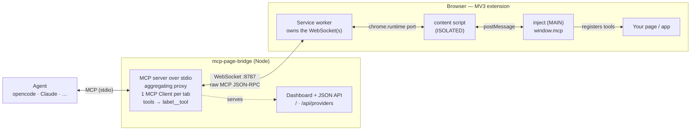

# mcp-page-bridge details

This file keeps the detailed project, authoring, and internals documentation. The root `README.md` is intentionally short and end-user focused.

<p align="center">
  
</p>

<h1 align="center">mcp-page-bridge</h1>

<p align="center">
  Bridge a <strong>live browser page's MCP server</strong> to a coding agent (opencode, Claude, …).
</p>

A page exposes its own tools with `window.mcp` (injected by the mcp-page-bridge browser
extension). The extension tunnels them over a WebSocket to a local bridge, and
the bridge re-exposes everything to the agent as a standard MCP server over
stdio. The agent can then call the page's tools directly.



- **The wire is real MCP JSON-RPC.** Each browser tab is its own MCP *server*;
  the bridge runs one MCP *Client* per tab and merges them into one MCP server
  for the agent (tools namespaced as `label__tool`).
- **Extension-only.** The page never opens a socket itself (an https page can't
  reach `ws://127.0.0.1` due to CSP/mixed-content). The service worker owns the
  WebSocket.
- **Two authoring paths**, same wire:
  - **Lightweight** — `window.mcp = { label, tools }` (plain page data).
  - **Full SDK** — `await window.mcp.connect(myMcpServer)` or
    `myMcpServer.connect(window.mcp.transport())`.

## Repository layout

```
packages/
  protocol/    shared helpers + the internal channel envelope (dependency-free)
  server/      the mcp-page-bridge bridge: stdio MCP server + WS server + aggregating proxy
  extension/   MV3 extension: inject (window.mcp), content relay, SW, popup
examples/
  demo-app/    static page exposing tools via window.mcp
  svelte-app/  Svelte 5 (runes) app exposing its $state via window.mcp
```

## Examples

- `examples/demo-app` — zero-build static page. `pnpm --filter @mcp-page-bridge/demo-app serve` → http://localhost:3000
- `examples/svelte-app` — Svelte 5 + Vite app whose runes `$state` is driven by the agent. `pnpm --filter @mcp-page-bridge/example-svelte dev` → http://localhost:5173 (tools: `svelte__increment`, `svelte__addTodo`, `svelte__getState`, …)

## Quick start

Prereqs: Node ≥ 18, pnpm, a Chromium browser.

```bash
pnpm install
pnpm approve-builds --all      # one-time: allow esbuild's native binary
pnpm -r build                  # builds protocol + dashboard (Go embed) + extension (dist/)
```

1. **Run the bridge** (the agent normally spawns this; you can also run it
   standalone to watch logs):

   ```bash
   pnpm server                                # = go run ./cmd/mcp-page-bridge --daemon
   # or: go run ./cmd/mcp-page-bridge --daemon --port 8787
   # optional auth: go run ./cmd/mcp-page-bridge --daemon --token secret
   ```

   Then open **http://127.0.0.1:8787/** in a browser for the live dashboard —
   it lists connected tabs and their registered tools, with
   shortcuts to focus or close the related browser tab (JSON at `GET /api/providers`).

2. **Load the extension**: open `chrome://extensions`, enable *Developer mode*,
   *Load unpacked* → select `packages/extension/dist`.

3. **Open the demo app**:

   ```bash
   pnpm --filter @mcp-page-bridge/demo-app serve        # http://localhost:3000
   ```

   Open it, click the mcp-page-bridge toolbar icon, and **Enable on this tab**.

4. **Point your agent at the bridge** — see [Connecting your agent](#connecting-your-agent).
   The agent will see `mcp_page_bridge_list_clients` plus the demo's tools
   (`demo__getCount`, `demo__increment`, `demo__setCount`, `demo__getState`).

## Connecting your agent

`mcp-page-bridge` is a **local (stdio)** MCP server: the agent spawns it, and it accepts
the browser's WebSocket and re-exposes the page's tools. Add it to your agent's
MCP config like any other stdio server. (The daemon also exposes a
[Streamable HTTP endpoint](#remote-url--streamable-http) for clients that
prefer a remote URL.)

> **From a local checkout**, replace `npx -y mcp-page-bridge` everywhere below with
> the built binary: `go build -o mcp-page-bridge ./cmd/mcp-page-bridge` and use
> `/ABSOLUTE/PATH/mcp-page-bridge/mcp-page-bridge`. Flags/env are the same.

Flags: `--port <n>` (default 8787), `--token <secret>`, `--host <addr>` (default `127.0.0.1`).
Env: `MCP_PAGE_BRIDGE_PORT`, `MCP_PAGE_BRIDGE_TOKEN`, `MCP_PAGE_BRIDGE_HOST`.

> **Remote browser**: to connect a browser on another device (phone/laptop on
> your LAN), start the bridge with `--host 0.0.0.0 --token <secret>` and set the
> same host/IP + token in the extension popup. A token is **strongly
> recommended** for any non-loopback bind — without one, page tools (`eval`
> etc.) are open to the network and the bridge only logs a warning. The
> Host/Origin checks relax to port matching in this mode; the token carries the
> authorization.

### Per-tab bridges, profiles, and tab groups

The extension keeps a small list of **bridge profiles** — one per unique
`(host, port, token)` triple. Saving settings that point at an
already-known daemon reuses its profile automatically, so tabs aimed at the
same daemon are grouped together without any bookkeeping. The popup shows the
profiles in a **Recent** dropdown (most recently used first, capped at 8 with
LRU eviction; profiles in use are never evicted).

By default every tab follows the **global default profile**. Turn on **"Use a
custom bridge for this tab"** in the popup to pin the active tab to a different
daemon — e.g. tab A on `:8787` for one agent and tab B on `:8788` for another.
Pins live for the browser session (and the tab's lifetime); changing a bridge
bounces only the affected tabs' sockets. The opt-in **"Browser control"**
provider always connects to the default profile.

The optional **"Group tabs by bridge"** switch (off by default) mirrors the
grouping visually: enabled tabs are placed into Chrome tab groups named
`host:port` with a per-profile color. Only groups created by the extension are
ever touched, and turning the switch off releases the tabs again.

Multiple agents can use the same port. On first use, `mcp-page-bridge` starts a
detached local bridge daemon that owns the browser WebSocket/dashboard port.
Every agent process, including the first one, attaches its stdio MCP connection
to that daemon over a local `/agent` WebSocket. Closing the first agent session
only closes that session's proxy; the bridge daemon keeps running for later
agents and browser tabs. If you use `--token`, every agent process must use the
same token.

When browser providers connect or disconnect, the daemon sends MCP
`tools/listChanged`, `prompts/listChanged`, and `resources/listChanged`
notifications to all attached agents so they can invalidate cached catalogs and
list again. Tool identity is the namespaced tool name (`label__tool`), never its
position in a list. Duplicate provider labels are reserved by browser
tab/provider identity inside the daemon, so the same provider keeps its namespace
across reconnects even if other providers reconnect in a different order.

To stop the daemon, either:

- run `mcp-page-bridge stop --port <n>` (add `--token <secret>` if the daemon
  uses one), or
- open the dashboard at `http://127.0.0.1:<port>/` and click **Shutdown bridge**.

Both call `POST /api/shutdown`; the bridge closes its browser and agent sockets,
stops the HTTP/WebSocket listener, removes its PID file, and the detached daemon
process exits once no handles remain. The daemon writes its PID to
`<os-tmp>/mcp-page-bridge-<port>.pid` so `stop` can fall back to a signal if the
HTTP request fails.

Pass `--idle-timeout <seconds>` to have a freshly spawned daemon shut itself down
after that many seconds with no attached agents and no connected browser
providers (off by default). The agent that first spawns the daemon forwards this
flag.

### Local HTTP security

The bridge binds to `127.0.0.1` and validates the `Host`/`Origin` of every HTTP
request, so other web pages (and DNS-rebinding attempts) cannot reach the JSON
API or the shutdown/tab-control endpoints. State-changing requests additionally
require an internal dashboard header. When a `--token` is configured it is
required on the HTTP API too — open the dashboard as
`http://127.0.0.1:<port>/?token=<secret>` so its requests carry the token.

### Runtime: Node, Bun, or Deno

Node isn't required — it's just the default. The bridge's only runtime
dependencies are `ws` and `node:crypto` (both supported by Bun and Deno), and
the MCP SDK is cross-runtime, so the agent's `command` can use any of:

| Runtime | `command` example |
| --- | --- |
| Node | `["npx", "-y", "mcp-page-bridge", "--port", "8787"]` |
| Bun | `["bunx", "mcp-page-bridge", "--port", "8787"]` |
| Deno | `["deno", "run", "-A", "npm:mcp-page-bridge", "--port", "8787"]` |

The npm package is a thin launcher around the native Go binary, so the runtime
above only spawns the launcher — the bridge itself has no Node/Bun/Deno
dependency. You can also skip npm entirely and run the
[standalone binary](https://github.com/rytsh/mcp-page-bridge/releases) directly.

### opencode

`opencode.json` (project) or `~/.config/opencode/opencode.json` (global):

```jsonc
{
  "$schema": "https://opencode.ai/config.json",
  "mcp": {
    "mcp-page-bridge": {
      "type": "local",
      "command": ["npx", "-y", "mcp-page-bridge", "--port", "8787"],
      "enabled": true
      // optional token: add "--token", "secret" above, or:
      // "environment": { "MCP_PAGE_BRIDGE_TOKEN": "secret" }
    }
  }
}
```

opencode prefixes MCP tools with the server name, so the demo's tools show up as
`mcp-page-bridge_demo__increment`, etc. Prompt with e.g. *"use the mcp-page-bridge tools to …"*.

### Claude Code (CLI)

```bash
claude mcp add mcp-page-bridge -- npx -y mcp-page-bridge --port 8787
# with a token:
claude mcp add mcp-page-bridge --env MCP_PAGE_BRIDGE_TOKEN=secret -- npx -y mcp-page-bridge --port 8787
```

### Claude Desktop

Edit `claude_desktop_config.json` (macOS: `~/Library/Application Support/Claude/`,
Windows: `%APPDATA%\Claude\`), then restart the app:

```json
{
  "mcpServers": {
    "mcp-page-bridge": { "command": "npx", "args": ["-y", "mcp-page-bridge", "--port", "8787"] }
  }
}
```

### Cursor / Windsurf / VS Code (and other `mcpServers` clients)

`.cursor/mcp.json` (project) or the client's global MCP config:

```json
{
  "mcpServers": {
    "mcp-page-bridge": {
      "command": "npx",
      "args": ["-y", "mcp-page-bridge", "--port", "8787"],
      "env": { "MCP_PAGE_BRIDGE_TOKEN": "" }
    }
  }
}
```

### Any other MCP client

It's a standard stdio MCP server — run `npx -y mcp-page-bridge` (or a standalone
binary) as the command. `stdout` is the MCP channel; logs go to `stderr`.

### Remote URL — Streamable HTTP

The daemon also serves the MCP **Streamable HTTP** transport at
`http://<host>:<port>/mcp`, so clients that support remote MCP servers can skip
the stdio proxy entirely and connect by URL — including to a daemon on another
machine (start it there with `--host 0.0.0.0 --token <secret>`):

```jsonc
// opencode
{
  "mcp": {
    "mcp-page-bridge": {
      "type": "remote",
      "url": "http://192.168.1.50:8787/mcp",
      "headers": { "Authorization": "Bearer <secret>" },
      "enabled": true
    }
  }
}
```

```bash
# Claude Code
claude mcp add --transport http mcp-page-bridge http://192.168.1.50:8787/mcp \
  --header "Authorization: Bearer <secret>"
```

Endpoint behaviour:

- `POST /mcp` — JSON-RPC requests. `initialize` opens a session and returns an
  `Mcp-Session-Id` response header; all later requests must echo that header.
  Notifications are answered with `202 Accepted`. An unknown/expired session
  returns `404` (re-initialize). JSON-RPC batching is not supported.
- `GET /mcp` — optional SSE stream (one per session) carrying server-initiated
  notifications: `tools/prompts/resources list_changed` and forwarded page
  `notifications/message` logs.
- `DELETE /mcp` — ends the session. Sessions also expire after 30 minutes
  without requests (an open SSE stream keeps them alive), and they count as
  agent connections for `--idle-timeout` purposes.
- When a token is configured, every `/mcp` request must carry it as
  `Authorization: Bearer <secret>`, an `x-mcp-page-bridge-token` header, or a
  `?token=<secret>` query parameter.

### Putting it together

1. Start a session — your agent spawns `mcp-page-bridge` (or run it yourself to watch logs).
2. Open your page, click the **mcp-page-bridge** toolbar icon → **Enable on this tab** (set
   the same port/token as the bridge).
3. The agent now sees `mcp_page_bridge_list_clients` plus your page's tools. A good first
   prompt: *"call mcp_page_bridge_list_clients to see which browser tabs are connected."*

## Authoring tools in your own page

Recommended: declare a plain `window.mcp` manifest. No extension API call, no
timing dependency; this works even if the page runs before the extension injects.

```js
window.mcp = {
  label: "checkout",
  tools: {
    getCart: () => store.getState().cart,
    addItem: {
      description: "Add an item to the cart",
      inputSchema: { type: "object", properties: { id: { type: "string" } }, required: ["id"] },
      handler: (args) => store.addItem(args.id),
    },
  },
};
```

If the extension has already injected, the same object also has optional helper
methods. They are useful for imperative integrations, but not required:

```js
window.mcp?.setLabel("checkout");
window.mcp?.tool(
  { name: "getCart", description: "Return the current cart" },
  () => store.getState().cart,
);
```

Full MCP SDK (resources/prompts/etc.):

```js
import { McpServer } from "@modelcontextprotocol/sdk/server/mcp.js";
const server = new McpServer({ name: "checkout", version: "1.0.0" });
server.registerTool("getCart", { /* ... */ }, async () => ({ /* ... */ }));
await window.mcp.connect(server);
```

If the extension isn't installed, `window.mcp` is just inert page data. When the
extension is enabled later, it merges its helper methods onto the existing object
without deleting `label` or `tools`.

If your app later replaces `window.mcp` or mutates `window.mcp.tools`, the
extension picks up the change while the tab is enabled. A changed `label`/`name`
reconnects the provider so the dashboard and agent see the new namespace.

## Built-in tools

When a tab is enabled, the extension exposes a lean **core** built-in toolset on
the same provider (so any page is reachable even without calling `window.mcp`):

`eval` (run JS in the page), `dom_query`, `get_html`, `get_page_info`, `click`,
`set_value`, `scroll`, `wait_for`, `console_logs` (captured from
`document_start`), `screenshot` (pass `download:true` to also save the PNG to
the browser's Downloads folder), `navigate`, `reload`.

The popup's **Core tools (default MCPs)** switch controls this lean default
toolset and is checked by default. Turn it off before enabling a tab if you only
want page-declared tools and/or the opt-in tool groups below.

This core set is kept small on purpose: every tool's name + schema sits in the
agent's tool list and costs tokens for the whole session, so the heavier
**design/selection toolset** below is **opt-in**. Turn it on with the **Design
tools** switch in the popup (off by default); the change applies to enabled tabs
immediately. With design tools off the catalog is ~12 tools; on, it adds the 21
selection/CSS/audit tools listed below.

The popup also has a separate **Automation tools** switch for Playwright-like live
page automation. It adds a uid-based page snapshot (`take_snapshot` returns a
compact text tree of interactive/structural elements with stable `uid`s; pass
`uid` to the action tools below instead of guessing CSS selectors — uids go
stale after navigation/DOM changes, just re-snapshot), locator helpers
(`find_by_text`, `find_by_role`, `find_by_label`, `find_by_test_id`,
`locator_snapshot`, `locator_count`), safer
actions (`smart_click`, `hover`, `double_click`, `type_text`, `press_key`,
`clear_value`, `select_option`, `check`, `uncheck`, `upload_file`,
`drag_and_drop` — all accepting `uid` or a locator), page-level `fetch`/`XMLHttpRequest` capture
(`start_network_capture`, `stop_network_capture`, `list_network_requests`,
`wait_for_response`, `get_response_body`, `clear_network_capture`),
storage/cookie helpers, dialog auto-handling,
same-origin iframe helpers, and best-effort `resize_window`. This is not a full
Playwright replacement: there is no isolated browser context, HTTP-only cookie
access, cross-origin iframe control, trace viewer, or video.

For browser-protocol-level work, the popup has a separate **Advanced CDP tools**
switch. It requests Chrome's optional `debugger` permission only when enabled.
Chrome shows a debugging banner while CDP is attached; turning the switch off or
calling `cdp_detach` detaches it. CDP tools include `cdp_status`, `cdp_attach`,
`cdp_detach`, `cdp_send_command`, `cdp_list_events`, `cdp_clear_events`,
`cdp_get_response_body`, `cdp_emulate_viewport`, `cdp_clear_emulation`,
`cdp_dispatch_mouse`, `cdp_dispatch_key`, `cdp_evaluate`,
`cdp_capture_screenshot`, `cdp_get_performance_metrics`,
`cdp_set_network_conditions`, `cdp_set_user_agent`, and `cdp_set_geolocation`. They can see browser-level
network events and use CDP input/emulation APIs, but still do not create
Playwright-style isolated browser contexts or multi-browser sessions.

Design tools: click **Pick element** in the popup, select a page
element, then tell your agent something like "make the place I picked look
better". **Pick element** replaces the current selection, **Add another** keeps
existing yellow markers and adds one more, **Clear selection** forgets them, and
the **View selection** switch hides/shows the markers without forgetting them.
The popup lists picked elements; each row can be named/grouped inline and has an
**×** button to unselect only that element. The popup also lists live CSS patches
with **Undo** and **Clear all** actions.
With the **Design tools** switch on, the agent can call `get_selected_element`,
`get_selected_elements`,
`get_computed_style`, `highlight_element`, `show_selected_marker`,
`hide_selected_marker`, `clear_selected_elements`, `remove_selected_element`,
`update_selected_element`, `apply_css`, `list_css_patches`, `remove_css_patch`,
`clear_css_patches`, `export_css_patches`, `export_design_changes`,
`capture_design_baseline`, `compare_design_baseline`, `clear_design_baseline`,
`accessibility_audit`, `responsive_summary`, and `debug_summary`. CSS patches
are temporary style tags in the live page and can be rolled back by patch id.
When the user asks to change a picked/selected/yellow element, agents should call
`get_selected_element` first, then call `apply_css` with `selector` omitted and
CSS declarations only (for example `color:red;`). Complete CSS rules such as
`.hero { color:red; }` are global/page-wide and are rejected while a selector or
picked element is targeted.

The picker closes the extension popup, shows an overlay on the page, records the
next clicked element in the page's built-in tool state, and leaves persistent
yellow transparent markers on picked elements. You can refer to them as "the
yellow selected areas" in the agent chat. It works on normal `http`/`https` pages;
Chromium blocks extension scripts on pages such as `chrome://`, the Chrome Web
Store, and some restricted browser pages.

Disable all built-ins per page with `window.mcp.builtins(false)` before the tab
is enabled, or disable only the powerful `eval` tool (keeping the rest) with
`window.mcp.allowEval(false)`. Note: `eval` is also blocked on pages with a
strict `Content-Security-Policy` (no `unsafe-eval`), such as GitHub. On those
pages, use the dedicated non-eval tools (`dom_query`, `get_selected_element`,
`apply_css`, `click`, etc.) instead of injecting inline/script-tag JavaScript.

### Browser control (opt-in)

By default tools are **tab-scoped** — they act on the page they're registered
in. Enable **"Browser control (all tabs)"** in the popup to also expose a
separate **`browser`** provider (hosted by the service worker, independent of any
page) with: `list_tabs`, `open_tab`, `activate_tab`, `navigate_tab`,
`close_tab`. This is more powerful (it can open/close/navigate *any* tab), so
it's off by default. It's still localhost-only and every call is gated by your
agent's permission prompts.

## How it connects / is detected

- The extension injects `window.mcp` at `document_start` (MAIN world).
- A page opts in by declaring `window.mcp = { label, tools }`, calling
  `window.mcp.tool(...)`, or connecting a full MCP server with `window.mcp.connect(...)`.
- Nothing connects until the tab is **enabled** in the popup. On enable, the SW
  opens one WebSocket per provider to the bridge; the bridge runs the MCP
  `initialize` handshake and reads the provider's `serverInfo`/tools.
- Multiple tabs can connect simultaneously; their tools are namespaced by label.
  `mcp_page_bridge_list_clients` shows what's connected.

## Security

- The bridge binds to `127.0.0.1` by default. Binding a non-loopback host
  (`--host 0.0.0.0`) without a token is allowed but logs a warning — anyone on
  the network can then reach the connected pages' tools (WebSocket and
  `/mcp`); only do this on a trusted/isolated network.
- Optional shared token: run `mcp-page-bridge --token <secret>` (or `MCP_PAGE_BRIDGE_TOKEN=<secret>`)
  and enter the same token in the extension popup. Without it, any local process
  can connect — fine on a trusted machine.
- Built-in TLS: `--tls-cert <fullchain.pem> --tls-key <privkey.pem>` makes the
  daemon serve `https://`/`wss://`, protecting the token and all traffic on
  the wire. Clients opt in with `--tls` (the stdio proxy and `stop` then dial
  `https`/`wss`), plus `--tls-ca <ca.pem>` to trust a private CA or
  `--tls-insecure` to skip verification (testing only). The extension has a
  matching **Secure connection (TLS / wss)** toggle per bridge profile; the
  browser must trust the certificate. Binding a non-loopback host without TLS
  logs a warning. Env equivalents: `MCP_PAGE_BRIDGE_TLS`,
  `MCP_PAGE_BRIDGE_TLS_CERT`, `MCP_PAGE_BRIDGE_TLS_KEY`,
  `MCP_PAGE_BRIDGE_TLS_CA`, `MCP_PAGE_BRIDGE_TLS_INSECURE_SKIP_VERIFY`.
- Tool calls execute code in your page; the agent gates each call behind its own
  permission prompts.

## Development

```bash
go test ./...     # bridge test suite (e2e over real sockets); requires Go
pnpm test         # vitest (extension + embedded server e2e against the Go bridge)
pnpm typecheck    # tsc across all packages
pnpm --filter @mcp-page-bridge/extension dev   # rebuild extension on change
pnpm server                                    # run the bridge daemon in the foreground
pnpm --filter mcp-page-bridge-dashboard dev    # dashboard UI with Vite dev server
```

> The extension e2e tests spawn the Go bridge, so a Go toolchain is required
> for `pnpm test` as well.

### Local Extension Build

If you do not want to use a release zip, build the extension locally:

```bash
pnpm install
pnpm approve-builds --all
pnpm --filter @mcp-page-bridge/extension build
```

Then open `chrome://extensions`, enable **Developer mode**, click **Load unpacked**, and select `packages/extension/dist`.

### The Go bridge and npm distribution

The bridge implementation is Go (`cmd/mcp-page-bridge` + `internal/`, built on
the rakunlabs stack: into/logi/chu/ada). Release binaries (~9 MB, CGO-free) are
built with goreleaser and attached to each GitHub Release.

The `mcp-page-bridge` npm package is a thin launcher (esbuild/turbo model): the
binary ships in per-platform packages (`mcp-page-bridge-linux-x64`, …) wired as
`optionalDependencies`, so `npx -y mcp-page-bridge` downloads only the binary
matching your machine and passes stdio straight through.

```bash
go test ./...                  # Go test suite (bridge e2e over real sockets)
go build ./cmd/mcp-page-bridge
pnpm build:binaries            # goreleaser snapshot build for all 5 targets → dist/
pnpm build:npm-packages        # dist/ → npm-dist/ per-platform npm packages
```

The status dashboard is a Svelte app in `packages/dashboard`, built to a single
HTML file and embedded into the binary via `go:embed`. After changing it, run
`pnpm --filter mcp-page-bridge-dashboard build` and commit the regenerated
`internal/server/assets/dashboard.html`.

## Status

- [x] Bridge (Go): stdio MCP proxy, WS server, aggregating daemon, namespacing, `mcp_page_bridge_list_clients`
- [x] Extension: `window.mcp` (lightweight + full SDK), content relay, SW WS manager (auto-reconnect), popup
- [x] Built-in tools (eval / DOM / console / screenshot / navigate / CSS design patches / element picker)
- [x] Prompts + resources aggregation, logging passthrough
- [x] Optional auth token; `npx mcp-page-bridge` launcher backed by per-platform binary packages
- [x] Status dashboard (Svelte) + JSON API on the bridge port (`/`, `/api/providers`, `/api/health`)
- [x] Published to npm; GitHub Release ships the extension zip + standalone Go binaries (linux/macos/windows)
- [x] Chrome Web Store listing; resource templates; `mcp_page_bridge_focus`

MIT © Eray Ates
