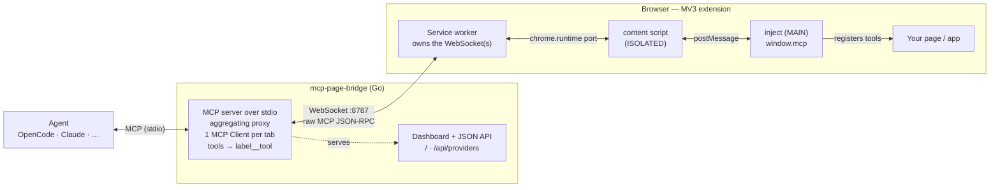

<p align="center">
  
</p>

<h1 align="center">MCP Page Bridge</h1>

<p align="center">
  Bridge a <strong>live browser page's MCP server</strong> to a coding agent (OpenCode, Claude, Cursor, ...).
</p>

<p align="center">
  <a href="https://www.npmjs.com/package/mcp-page-bridge"></a>
  <a href="https://chromewebstore.google.com/detail/mcp-page-bridge/lpehmmnlgeaocbnleigemiadocgadgmo"></a>
  <a href="https://github.com/rytsh/mcp-page-bridge/blob/main/LICENSE"></a>
</p>

`mcp-page-bridge` lets an MCP client/agent use tools exposed by the active browser page. It has two parts:

- A local MCP server (a single Go binary) started by your agent — via `npx`, or as a standalone download.
- A Chromium extension installed from the Chrome Web Store (or manually from GitHub Releases).



## Install

### 1. Install the Chrome extension

Add the `mcp-page-bridge` extension from the Chrome Web Store:

> https://chromewebstore.google.com/detail/mcp-page-bridge/lpehmmnlgeaocbnleigemiadocgadgmo

<details><summary>Alternative manual installation from GitHub Releases</summary>

1. Open the [GitHub Releases](https://github.com/rytsh/mcp-page-bridge/releases) page.
2. Download the extension zip from the latest release.
3. Unzip it locally.
4. Open `chrome://extensions`.
5. Enable **Developer mode**.
6. Click **Load unpacked** and select the unzipped extension folder containing `manifest.json`.

</details>

### 2. Add the MCP server to your agent

The bridge runs as a local MCP server over stdio, started via the published npm package with `npx` — or, if you don't have Node installed, via a [standalone binary](#standalone-binary) from GitHub Releases. Configure it once for your agent.

<details><summary>OpenCode</summary>

Add it to `opencode.json` (project) or `~/.config/opencode/opencode.json` (global):

```json
{
  "$schema": "https://opencode.ai/config.json",
  "mcp": {
    "mcp-page-bridge": {
      "type": "local",
      "command": ["npx", "-y", "mcp-page-bridge", "--port", "8787"],
      "enabled": true
    }
  }
}
```

</details>

<details><summary>Claude Code</summary>

Add it from the CLI:

```bash
claude mcp add mcp-page-bridge -- npx -y mcp-page-bridge --port 8787
```

Or add it to `.mcp.json` (project scope):

```json
{
  "mcpServers": {
    "mcp-page-bridge": {
      "command": "npx",
      "args": ["-y", "mcp-page-bridge", "--port", "8787"]
    }
  }
}
```

</details>

<details><summary>Claude Desktop · Cursor · other agents</summary>

Add it to the agent's MCP config (e.g. `claude_desktop_config.json`):

```json
{
  "mcpServers": {
    "mcp-page-bridge": {
      "command": "npx",
      "args": ["-y", "mcp-page-bridge", "--port", "8787"]
    }
  }
}
```

</details>

<a name="standalone-binary"></a>
<details><summary>Standalone binary — no Node/npx required</summary>

The bridge also ships as a single-binary Go implementation (~9 MB, no runtime needed). Each [GitHub Release](https://github.com/rytsh/mcp-page-bridge/releases) carries archives with stable (version-free) names, so the `latest` download URL always works:

| Platform | Asset |
|---|---|
| Linux x64 | `mcp-page-bridge-linux-x64.tar.gz` |
| Linux arm64 | `mcp-page-bridge-linux-arm64.tar.gz` |
| macOS Intel | `mcp-page-bridge-darwin-x64.tar.gz` |
| macOS Apple Silicon | `mcp-page-bridge-darwin-arm64.tar.gz` |
| Windows x64 | `mcp-page-bridge-windows-x64.zip` |

Download, extract, and (optionally) put the binary on your `PATH`:

```bash
curl -fsSL https://github.com/rytsh/mcp-page-bridge/releases/latest/download/mcp-page-bridge-linux-x64.tar.gz \
  | tar -xz mcp-page-bridge
sudo mv mcp-page-bridge /usr/local/bin/
```

Then reference the binary instead of `npx` in your agent config. For opencode:

```json
{
  "$schema": "https://opencode.ai/config.json",
  "mcp": {
    "mcp-page-bridge": {
      "type": "local",
      "command": ["mcp-page-bridge", "--port", "8787"],
      "enabled": true
    }
  }
}
```

For Claude / Cursor and other `mcpServers`-style agents:

```json
{
  "mcpServers": {
    "mcp-page-bridge": {
      "command": "mcp-page-bridge",
      "args": ["--port", "8787"]
    }
  }
}
```

> On macOS, downloaded binaries may be quarantined by Gatekeeper. Clear it with
> `xattr -d com.apple.quarantine ./mcp-page-bridge`.

With a Go toolchain you can also install straight from source:

```bash
go install github.com/rytsh/mcp-page-bridge/cmd/mcp-page-bridge@latest
```

</details>

<details><summary>Alternative local build and configuration</summary>

If you prefer a local checkout instead of the npm package (requires Go):

```bash
git clone https://github.com/rytsh/mcp-page-bridge.git
cd mcp-page-bridge
go build -o mcp-page-bridge ./cmd/mcp-page-bridge
```

Then point your agent at the built binary. For opencode:

```json
{
  "$schema": "https://opencode.ai/config.json",
  "mcp": {
    "mcp-page-bridge": {
      "type": "local",
      "command": ["/absolute/path/to/mcp-page-bridge/mcp-page-bridge", "--port", "8787"],
      "enabled": true
    }
  }
}
```

For Claude / Cursor and other `mcpServers`-style agents:

```json
{
  "mcpServers": {
    "mcp-page-bridge": {
      "command": "/absolute/path/to/mcp-page-bridge/mcp-page-bridge",
      "args": ["--port", "8787"]
    }
  }
}
```

</details>

<details><summary>Remote bridge — connect to a daemon on another machine</summary>

The daemon also speaks **MCP Streamable HTTP** at `http://<host>:<port>/mcp`,
so a daemon running on another machine can be added to your agent as a plain
remote MCP server URL — no local binary needed.

On the remote machine, start the daemon bound to a non-loopback address
(a token is strongly recommended; without one the bridge only logs a warning
and anyone on the network can reach the connected pages' tools):

```bash
mcp-page-bridge --host 0.0.0.0 --port 8787 --token <secret>
```

Then add the URL to your agent. For opencode:

```json
{
  "$schema": "https://opencode.ai/config.json",
  "mcp": {
    "mcp-page-bridge": {
      "type": "remote",
      "url": "http://192.168.1.50:8787/mcp",
      "headers": { "Authorization": "Bearer <secret>" },
      "enabled": true
    }
  }
}
```

For Claude Code:

```bash
claude mcp add --transport http mcp-page-bridge http://192.168.1.50:8787/mcp \
  --header "Authorization: Bearer <secret>"
```

For other agents, any of these carries the token:

- `Authorization: Bearer <secret>` header
- `x-mcp-page-bridge-token: <secret>` header
- `?token=<secret>` query parameter (`http://192.168.1.50:8787/mcp?token=<secret>`)

**Alternative: stdio proxy to a remote daemon.** If your agent only supports
stdio servers, run the binary locally pointed at the remote host — it probes
`host:port`, finds the running daemon, and acts as a thin stdio↔WebSocket
proxy instead of spawning a new one:

```json
{
  "mcpServers": {
    "mcp-page-bridge": {
      "command": "npx",
      "args": ["-y", "mcp-page-bridge", "--host", "192.168.1.50", "--port", "8787", "--token", "<secret>"]
    }
  }
}
```

The flags can also be supplied as `MCP_PAGE_BRIDGE_HOST`,
`MCP_PAGE_BRIDGE_PORT`, and `MCP_PAGE_BRIDGE_TOKEN` environment variables.

Notes:

- The same applies on a single machine: if a daemon is already listening on
  the port, a second one is never spawned — every agent connects to it. The
  local daemon is reachable at `http://127.0.0.1:8787/mcp` too.
- The extension popup on the remote browser needs the same host/IP + token.
- Traffic is plain `http://`/`ws://` — use a token and a trusted network (or
  an SSH tunnel / reverse proxy with TLS). See
  [DETAILS.md](DETAILS.md#security) for the security notes.

</details>

### 3. Use it

1. Start your agent session. The agent should spawn `mcp-page-bridge` from the MCP config.
2. Open the browser page you want to connect.
3. Click the `mcp-page-bridge` extension icon.
4. Click **Enable on this tab**.
5. Ask your agent to call `mcp_page_bridge_list_clients` to confirm the tab is connected.

Every enabled tab already exposes a lean set of built-in tools (`eval`,
`dom_query`, `click`, `screenshot`, `navigate`, …) — no page changes needed.

Optional dashboard: open `http://127.0.0.1:8787/` while the bridge is running.
Use **Shutdown bridge** there when you want to stop the background daemon.

> **Browser on another device?** Start the bridge with
> `--host 0.0.0.0 --token <secret>` and set the same Host/IP + token in the
> extension popup. A token is required for any non-loopback bind. See
> [DETAILS.md](DETAILS.md) for the security notes.

## Expose your page's own tools — `window.mcp`

The extension injects a `window.mcp` API into enabled tabs, so your app can
publish **its own** MCP tools to the agent. The simplest form is a plain
manifest — no imports, no extension API, no timing dependency (it works even if
the page runs before the extension injects):

```js
window.mcp = {
  label: "checkout", // tool namespace → checkout__getCart
  tools: {
    getCart: () => store.getState().cart,
    addItem: {
      description: "Add an item to the cart",
      inputSchema: { type: "object", properties: { id: { type: "string" } }, required: ["id"] },
      handler: (args) => store.addItem(args.id),
    },
  },
};
```

If the extension is not installed, `window.mcp` is just inert page data — safe
to ship in production. Tool changes are picked up live while the tab is enabled.
More in [DETAILS.md](DETAILS.md#authoring-tools-in-your-own-page); working examples:
[`examples/demo-app`](examples/demo-app) (vanilla) and
[`examples/svelte-app`](examples/svelte-app) (Svelte 5 runes).

## More Details

The full list of built-in tools (design/automation/CDP toolsets), advanced `window.mcp` usage, multi-agent behaviour, security notes, and development details are in [DETAILS.md](DETAILS.md).
