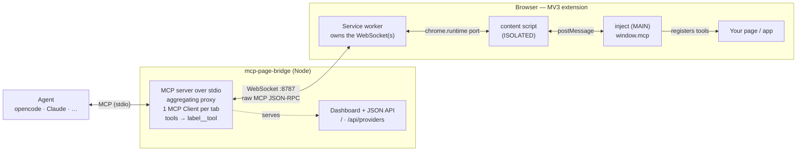

<p align="center">
  
</p>

<h1 align="center">mcp-page-bridge</h1>

<p align="center">
  Bridge a <strong>live browser page's MCP server</strong> to a coding agent (opencode, Claude, …).
</p>

A page exposes its own tools with `window.mcp` (injected by the mcp-page-bridge browser
extension). The extension tunnels them over a WebSocket to a local bridge, and
the bridge re-exposes everything to the agent as a standard MCP server over
stdio. The agent can then call the page's tools directly.



- **The wire is real MCP JSON-RPC.** Each browser tab is its own MCP *server*;
  the bridge runs one MCP *Client* per tab and merges them into one MCP server
  for the agent (tools namespaced as `label__tool`).
- **Extension-only.** The page never opens a socket itself (an https page can't
  reach `ws://127.0.0.1` due to CSP/mixed-content). The service worker owns the
  WebSocket.
- **Two authoring paths**, same wire:
  - **Lightweight** — `window.mcp = { label, tools }` (plain page data).
  - **Full SDK** — `await window.mcp.connect(myMcpServer)` or
    `myMcpServer.connect(window.mcp.transport())`.

## Repository layout

```
packages/
  protocol/    shared helpers + the internal channel envelope (dependency-free)
  server/      the mcp-page-bridge bridge: stdio MCP server + WS server + aggregating proxy
  extension/   MV3 extension: inject (window.mcp), content relay, SW, popup
examples/
  demo-app/    static page exposing tools via window.mcp
  svelte-app/  Svelte 5 (runes) app exposing its $state via window.mcp
```

## Examples

- `examples/demo-app` — zero-build static page. `pnpm --filter @mcp-page-bridge/demo-app serve` → http://localhost:3000
- `examples/svelte-app` — Svelte 5 + Vite app whose runes `$state` is driven by the agent. `pnpm --filter @mcp-page-bridge/example-svelte dev` → http://localhost:5173 (tools: `svelte__increment`, `svelte__addTodo`, `svelte__getState`, …)

## Quick start

Prereqs: Node ≥ 18, pnpm, a Chromium browser.

```bash
pnpm install
pnpm approve-builds --all      # one-time: allow esbuild's native binary
pnpm -r build                  # builds server (dist/cli.js) + extension (dist/)
```

1. **Run the bridge** (the agent normally spawns this; you can also run it
   standalone to watch logs):

   ```bash
   pnpm --filter mcp-page-bridge start        # ws://127.0.0.1:8787
   # or after build: node packages/server/dist/cli.js --port 8787
   # optional auth:  node packages/server/dist/cli.js --token secret
   ```

   Then open **http://127.0.0.1:8787/** in a browser for the live dashboard —
   it lists connected tabs and their registered tools, with
   shortcuts to focus or close the related browser tab (JSON at `GET /api/providers`).

2. **Load the extension**: open `chrome://extensions`, enable *Developer mode*,
   *Load unpacked* → select `packages/extension/dist`.

3. **Open the demo app**:

   ```bash
   pnpm --filter @mcp-page-bridge/demo-app serve        # http://localhost:3000
   ```

   Open it, click the mcp-page-bridge toolbar icon, and **Enable on this tab**.

4. **Point your agent at the bridge** — see [Connecting your agent](#connecting-your-agent).
   The agent will see `mcp_page_bridge_list_clients` plus the demo's tools
   (`demo__getCount`, `demo__increment`, `demo__setCount`, `demo__getState`).

## Connecting your agent

`mcp-page-bridge` is a **local (stdio)** MCP server: the agent spawns it, and it accepts
the browser's WebSocket and re-exposes the page's tools. Add it to your agent's
MCP config like any other stdio server.

> **Before it's published to npm**, replace `npx -y mcp-page-bridge` everywhere below with
> the built binary:
> `node /ABSOLUTE/PATH/mcp-page-bridge/packages/server/dist/cli.js`
> (run `pnpm --filter mcp-page-bridge build` once first). Flags/env are the same.

Flags: `--port <n>` (default 8787), `--token <secret>`. Env: `MCP_PAGE_BRIDGE_PORT`, `MCP_PAGE_BRIDGE_TOKEN`.

### Runtime: Node, Bun, or Deno

Node isn't required — it's just the default. The bridge's only runtime
dependencies are `ws` and `node:crypto` (both supported by Bun and Deno), and
the MCP SDK is cross-runtime, so the agent's `command` can use any of:

| Runtime | `command` example |
| --- | --- |
| Node | `["npx", "-y", "mcp-page-bridge", "--port", "8787"]` |
| Bun | `["bunx", "mcp-page-bridge", "--port", "8787"]` |
| Deno | `["deno", "run", "-A", "npm:mcp-page-bridge", "--port", "8787"]` |

Bun and Deno can also run the TypeScript source directly (no build step):
`bun packages/server/src/cli.ts --port 8787`. Bun is fully supported. On Deno,
the only thing to watch is the `ws` server (it relies on the `node:http`
`upgrade` event) — it works on recent Deno via npm compat; if you hit issues,
fall back to Node or Bun. The published `bin` shebang is `#!/usr/bin/env node`,
so plain `npx mcp-page-bridge` always uses Node.

### opencode

`opencode.json` (project) or `~/.config/opencode/opencode.json` (global):

```jsonc
{
  "$schema": "https://opencode.ai/config.json",
  "mcp": {
    "mcp-page-bridge": {
      "type": "local",
      "command": ["npx", "-y", "mcp-page-bridge", "--port", "8787"],
      "enabled": true
      // optional token: add "--token", "secret" above, or:
      // "environment": { "MCP_PAGE_BRIDGE_TOKEN": "secret" }
    }
  }
}
```

opencode prefixes MCP tools with the server name, so the demo's tools show up as
`mcp-page-bridge_demo__increment`, etc. Prompt with e.g. *"use the mcp-page-bridge tools to …"*.

### Claude Code (CLI)

```bash
claude mcp add mcp-page-bridge -- npx -y mcp-page-bridge --port 8787
# with a token:
claude mcp add mcp-page-bridge --env MCP_PAGE_BRIDGE_TOKEN=secret -- npx -y mcp-page-bridge --port 8787
```

### Claude Desktop

Edit `claude_desktop_config.json` (macOS: `~/Library/Application Support/Claude/`,
Windows: `%APPDATA%\Claude\`), then restart the app:

```json
{
  "mcpServers": {
    "mcp-page-bridge": { "command": "npx", "args": ["-y", "mcp-page-bridge", "--port", "8787"] }
  }
}
```

### Cursor / Windsurf / VS Code (and other `mcpServers` clients)

`.cursor/mcp.json` (project) or the client's global MCP config:

```json
{
  "mcpServers": {
    "mcp-page-bridge": {
      "command": "npx",
      "args": ["-y", "mcp-page-bridge", "--port", "8787"],
      "env": { "MCP_PAGE_BRIDGE_TOKEN": "" }
    }
  }
}
```

### Any other MCP client

It's a standard stdio MCP server — run `npx -y mcp-page-bridge` (or the `dist/cli.js`
path) as the command. `stdout` is the MCP channel; logs go to `stderr`.

### Putting it together

1. Start a session — your agent spawns `mcp-page-bridge` (or run it yourself to watch logs).
2. Open your page, click the **mcp-page-bridge** toolbar icon → **Enable on this tab** (set
   the same port/token as the bridge).
3. The agent now sees `mcp_page_bridge_list_clients` plus your page's tools. A good first
   prompt: *"call mcp_page_bridge_list_clients to see which browser tabs are connected."*

## Authoring tools in your own page

Recommended: declare a plain `window.mcp` manifest. No extension API call, no
timing dependency; this works even if the page runs before the extension injects.

```js
window.mcp = {
  label: "checkout",
  tools: {
    getCart: () => store.getState().cart,
    addItem: {
      description: "Add an item to the cart",
      inputSchema: { type: "object", properties: { id: { type: "string" } }, required: ["id"] },
      handler: (args) => store.addItem(args.id),
    },
  },
};
```

If the extension has already injected, the same object also has optional helper
methods. They are useful for imperative integrations, but not required:

```js
window.mcp?.setLabel("checkout");
window.mcp?.tool(
  { name: "getCart", description: "Return the current cart" },
  () => store.getState().cart,
);
```

Full MCP SDK (resources/prompts/etc.):

```js
import { McpServer } from "@modelcontextprotocol/sdk/server/mcp.js";
const server = new McpServer({ name: "checkout", version: "1.0.0" });
server.registerTool("getCart", { /* ... */ }, async () => ({ /* ... */ }));
await window.mcp.connect(server);
```

If the extension isn't installed, `window.mcp` is just inert page data. When the
extension is enabled later, it merges its helper methods onto the existing object
without deleting `label` or `tools`.

If your app later replaces `window.mcp` or mutates `window.mcp.tools`, the
extension picks up the change while the tab is enabled. A changed `label`/`name`
reconnects the provider so the dashboard and agent see the new namespace.

## Built-in tools

When a tab is enabled, the extension also exposes a built-in toolset on the same
provider (so any page is reachable even without calling `window.mcp`):

`eval` (run JS in the page), `dom_query`, `get_html`, `get_page_info`, `click`,
`set_value`, `scroll`, `wait_for`, `console_logs` (captured from
`document_start`), `screenshot` (pass `download:true` to also save the PNG to
the browser's Downloads folder), `navigate`, `reload`. Disable them per page
with `window.mcp.builtins(false)` before the tab is enabled. Note: `eval` is
blocked on pages with a strict `Content-Security-Policy` (no `unsafe-eval`).

### Browser control (opt-in)

By default tools are **tab-scoped** — they act on the page they're registered
in. Enable **"Browser control (all tabs)"** in the popup to also expose a
separate **`browser`** provider (hosted by the service worker, independent of any
page) with: `list_tabs`, `open_tab`, `activate_tab`, `navigate_tab`,
`close_tab`. This is more powerful (it can open/close/navigate *any* tab), so
it's off by default. It's still localhost-only and every call is gated by your
agent's permission prompts.

## How it connects / is detected

- The extension injects `window.mcp` at `document_start` (MAIN world).
- A page opts in by declaring `window.mcp = { label, tools }`, calling
  `window.mcp.tool(...)`, or connecting a full MCP server with `window.mcp.connect(...)`.
- Nothing connects until the tab is **enabled** in the popup. On enable, the SW
  opens one WebSocket per provider to the bridge; the bridge runs the MCP
  `initialize` handshake and reads the provider's `serverInfo`/tools.
- Multiple tabs can connect simultaneously; their tools are namespaced by label.
  `mcp_page_bridge_list_clients` shows what's connected.

## Security

- The bridge binds to `127.0.0.1` only.
- Optional shared token: run `mcp-page-bridge --token <secret>` (or `MCP_PAGE_BRIDGE_TOKEN=<secret>`)
  and enter the same token in the extension popup. Without it, any local process
  can connect — fine on a trusted machine.
- Tool calls execute code in your page; the agent gates each call behind its own
  permission prompts.

## Development

```bash
pnpm test         # vitest (bridge + embedded server + e2e over a real socket)
pnpm typecheck    # tsc across all packages
pnpm --filter @mcp-page-bridge/extension dev   # rebuild extension on change
pnpm --filter mcp-page-bridge dev              # run bridge with reload
```

## Status

- [x] Bridge: stdio MCP server, WS server, aggregating proxy, namespacing, `mcp_page_bridge_list_clients`
- [x] Extension: `window.mcp` (lightweight + full SDK), content relay, SW WS manager (auto-reconnect), popup
- [x] Built-in tools (eval / DOM / console / screenshot / navigate / set_value / click)
- [x] Prompts + resources aggregation, logging passthrough
- [x] Optional auth token; `npx mcp-page-bridge` bin; runs on Node / Bun / Deno
- [x] Status dashboard + JSON API on the bridge port (`/`, `/api/providers`)
- [ ] Publish to npm + Chrome Web Store zip; resource templates; `mcp_page_bridge_focus`

MIT © Eray Ates
