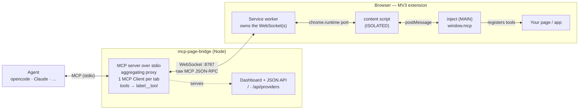

<p align="center">
  
</p>

<h1 align="center">mcp-page-bridge</h1>

<p align="center">
  Bridge a <strong>live browser page's MCP server</strong> to a coding agent (opencode, Claude, Cursor, ...).
</p>

<p align="center">
  <a href="https://www.npmjs.com/package/mcp-page-bridge"></a>
  <a href="https://chromewebstore.google.com/detail/mcp-page-bridge/lpehmmnlgeaocbnleigemiadocgadgmo"></a>
  <a href="https://github.com/rytsh/mcp-page-bridge/blob/main/LICENSE"></a>
</p>

`mcp-page-bridge` lets an MCP client/agent use tools exposed by the active browser page. It has two parts:

- A local MCP server started by your agent, or manually from your terminal.
- A Chromium extension installed from the Chrome Web Store (or manually from GitHub Releases).



## Install

### 1. Install the Chrome extension

Add `mcp-page-bridge` extension in Chrome web Store.

> https://chromewebstore.google.com/detail/mcp-page-bridge/lpehmmnlgeaocbnleigemiadocgadgmo

<details><summary>Alternative manual installation from GitHub Releases</summary>

1. Open the [GitHub Releases](https://github.com/rytsh/mcp-page-bridge/releases) page.
2. Download the extension zip from the latest release.
3. Unzip it locally.
4. Open `chrome://extensions`.
5. Enable **Developer mode**.
6. Click **Load unpacked** and select the unzipped extension folder containing `manifest.json`.

</details>

### 2. Add the MCP server to your agent

The bridge runs as a local MCP server over stdio, started via the published npm package with `npx`. Configure it once for your agent.

<details><summary>OpenCode</summary>

Add it to `opencode.json` (project) or `~/.config/opencode/opencode.json` (global):

```json
{
  "$schema": "https://opencode.ai/config.json",
  "mcp": {
    "mcp-page-bridge": {
      "type": "local",
      "command": ["npx", "-y", "mcp-page-bridge", "--port", "8787"],
      "enabled": true
    }
  }
}
```

</details>

<details><summary>Claude Code</summary>

Add it from the CLI:

```bash
claude mcp add mcp-page-bridge -- npx -y mcp-page-bridge --port 8787
```

Or add it to `.mcp.json` (project scope):

```json
{
  "mcpServers": {
    "mcp-page-bridge": {
      "command": "npx",
      "args": ["-y", "mcp-page-bridge", "--port", "8787"]
    }
  }
}
```

</details>

<details><summary>Claude Desktop · Cursor · other agents</summary>

Add it to the agent's MCP config (e.g. `claude_desktop_config.json`):

```json
{
  "mcpServers": {
    "mcp-page-bridge": {
      "command": "npx",
      "args": ["-y", "mcp-page-bridge", "--port", "8787"]
    }
  }
}
```

</details>

<details><summary>Alternative local build and configuration</summary>

If you prefer a local checkout instead of the npm package:

```bash
git clone https://github.com/rytsh/mcp-page-bridge.git
cd mcp-page-bridge
pnpm install
pnpm approve-builds --all
pnpm --filter mcp-page-bridge build
```

Then point your agent at the built local CLI. For opencode:

```json
{
  "$schema": "https://opencode.ai/config.json",
  "mcp": {
    "mcp-page-bridge": {
      "type": "local",
      "command": ["node", "/absolute/path/to/mcp-page-bridge/packages/server/dist/cli.js", "--port", "8787"],
      "enabled": true
    }
  }
}
```

For Claude / Cursor and other `mcpServers`-style agents:

```json
{
  "mcpServers": {
    "mcp-page-bridge": {
      "command": "node",
      "args": ["/absolute/path/to/mcp-page-bridge/packages/server/dist/cli.js", "--port", "8787"]
    }
  }
}
```

</details>

### 3. Use it

1. Start your agent session. The agent should spawn `mcp-page-bridge` from the MCP config.
2. Open the browser page you want to connect.
3. Click the `mcp-page-bridge` extension icon.
4. Click **Enable on this tab**.
5. Ask your agent to call `mcp_page_bridge_list_clients` to confirm the tab is connected.

Optional dashboard: open `http://127.0.0.1:8787/` while the bridge is running.
Use **Shutdown bridge** there when you want to stop the background daemon.

## More Details

Advanced usage, page authoring with `window.mcp`, built-in browser tools, security notes, examples, and development details are in [DETAILS.md](DETAILS.md).
