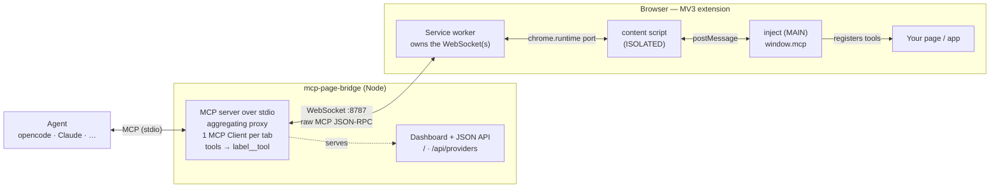

<p align="center">
  
</p>

<h1 align="center">mcp-page-bridge</h1>

<p align="center">
  Bridge a <strong>live browser page's MCP server</strong> to a coding agent (opencode, Claude, Cursor, ...).
</p>

`mcp-page-bridge` lets an MCP client/agent use tools exposed by the active browser page. It has two parts:

- A local MCP server started by your agent, or manually from your terminal.
- A Chromium extension loaded from GitHub Releases, because it is not published to the Chrome Web Store yet.



## Install

Requires Node.js 18 or newer. Local builds also require `pnpm`.

### 1. Install the Chrome extension

Chrome Web Store publishing is not available yet.

1. Open the [GitHub Releases](https://github.com/rytsh/mcp-page-bridge/releases) page.
2. Download the extension zip from the latest release.
3. Unzip it locally.
4. Open `chrome://extensions`.
5. Enable **Developer mode**.
6. Click **Load unpacked** and select the unzipped extension folder containing `manifest.json`.

### 2. Add the MCP server to your agent

Use the npm package when it is published:

```json
{
  "mcpServers": {
    "mcp-page-bridge": {
      "command": "npx",
      "args": ["-y", "mcp-page-bridge", "--port", "8787"]
    }
  }
}
```

If the npm package is not available yet, use a local checkout:

```bash
git clone https://github.com/rytsh/mcp-page-bridge.git
cd mcp-page-bridge
pnpm install
pnpm approve-builds --all
pnpm --filter mcp-page-bridge build
```

Then configure your agent with the built local CLI:

```json
{
  "mcpServers": {
    "mcp-page-bridge": {
      "command": "node",
      "args": ["/absolute/path/to/mcp-page-bridge/packages/server/dist/cli.js", "--port", "8787"]
    }
  }
}
```

### 3. Use it

1. Start your agent session. The agent should spawn `mcp-page-bridge` from the MCP config.
2. Open the browser page you want to connect.
3. Click the `mcp-page-bridge` extension icon.
4. Click **Enable on this tab**.
5. Ask your agent to call `mcp_page_bridge_list_clients` to confirm the tab is connected.

Optional dashboard: open `http://127.0.0.1:8787/` while the bridge is running.

## Local Extension Build

If you do not want to use a release zip, build the extension locally:

```bash
pnpm install
pnpm approve-builds --all
pnpm --filter @mcp-page-bridge/extension build
```

Then open `chrome://extensions`, enable **Developer mode**, click **Load unpacked**, and select `packages/extension/dist`.

## More Details

Advanced usage, page authoring with `window.mcp`, built-in browser tools, security notes, examples, and development details are in [DETAILS.md](DETAILS.md).

MIT © Eray Ates
